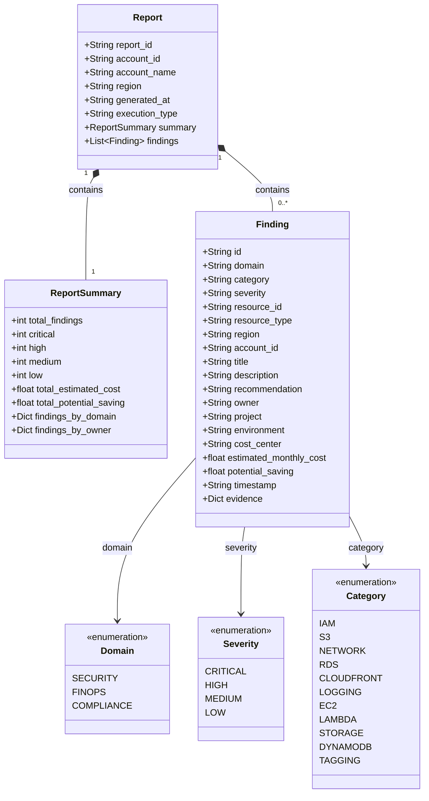

# Diagrama de Modelo de Datos — Cloud Governance Agent (CGA)

## Versión: 1.0.0 | Fecha: 2026-09-07

---

## Modelo de Entidades



---

## Estructura JSON del Reporte

```json
{
  "report_id": "a1b2c3d4-e5f6-7890-abcd-ef1234567890",
  "account_id": "748861776779",
  "account_name": "Mi Cuenta AWS",
  "region": "us-east-1",
  "generated_at": "2026-09-07T08:05:32Z",
  "execution_type": "scheduled",
  "summary": {
    "total_findings": 24,
    "critical": 3,
    "high": 8,
    "medium": 9,
    "low": 4,
    "total_estimated_cost": 1840.50,
    "total_potential_saving": 612.30,
    "findings_by_domain": {
      "security": 11,
      "finops": 9,
      "compliance": 4
    },
    "findings_by_owner": {
      "marcelo@empresa.com": 7,
      "devops@empresa.com": 12,
      "unknown": 5
    }
  },
  "findings": [
    {
      "id": "f1e2d3c4-b5a6-7890-abcd-123456789012",
      "domain": "security",
      "category": "iam",
      "severity": "critical",
      "resource_id": "arn:aws:iam::748861776779:user/admin-user",
      "resource_type": "AWS::IAM::User",
      "region": "global",
      "account_id": "748861776779",
      "title": "Usuario IAM sin MFA habilitado",
      "description": "El usuario 'admin-user' no tiene MFA habilitado, lo que expone la cuenta a accesos no autorizados si las credenciales son comprometidas.",
      "recommendation": "Habilitar MFA para el usuario. Ir a IAM → Users → admin-user → Security credentials → Assign MFA device.",
      "owner": "admin@empresa.com",
      "project": "infraestructura-core",
      "environment": "production",
      "cost_center": "TI-001",
      "estimated_monthly_cost": 0.0,
      "potential_saving": 0.0,
      "timestamp": "2026-09-07T08:01:15Z",
      "evidence": {
        "user_name": "admin-user",
        "create_date": "2025-01-15T10:30:00Z",
        "mfa_active": false,
        "password_last_used": "2026-09-06T14:22:00Z"
      }
    },
    {
      "id": "a2b3c4d5-e6f7-8901-bcde-234567890123",
      "domain": "finops",
      "category": "ec2",
      "severity": "high",
      "resource_id": "i-0123456789abcdef0",
      "resource_type": "AWS::EC2::Instance",
      "region": "us-east-1",
      "account_id": "748861776779",
      "title": "Instancia EC2 subutilizada — CPU promedio 2.3%",
      "description": "La instancia 't3.large' (i-0123456789abcdef0) ha tenido un promedio de CPU del 2.3% durante los últimos 7 días. Posiblemente sobredimensionada o candidata a terminación.",
      "recommendation": "Evaluar el redimensionamiento a t3.small o t3.micro. Si no es necesaria, terminar la instancia para evitar costos innecesarios.",
      "owner": "devops@empresa.com",
      "project": "backend-api",
      "environment": "staging",
      "cost_center": "ENG-002",
      "estimated_monthly_cost": 60.74,
      "potential_saving": 48.59,
      "timestamp": "2026-09-07T08:02:33Z",
      "evidence": {
        "instance_type": "t3.large",
        "state": "running",
        "launch_time": "2026-07-01T09:00:00Z",
        "cpu_avg_7d": 2.3,
        "cpu_max_7d": 8.1,
        "tags": {
          "Owner": "devops@empresa.com",
          "Project": "backend-api",
          "Environment": "staging",
          "CostCenter": "ENG-002"
        }
      }
    }
  ]
}
```

---

## Reglas de Negocio del Modelo

### Severidad
| Nivel | Criterio general |
|---|---|
| `critical` | Riesgo de seguridad inmediato o recurso completamente expuesto |
| `high` | Riesgo significativo o costo elevado con solución directa |
| `medium` | Riesgo moderado o costo controlable, acción recomendada en 30 días |
| `low` | Hallazgo informativo, acción recomendada en 90 días |

### Campo `evidence`
Contiene los datos crudos del recurso auditado tal como los retorna la API de AWS. Sirve como evidencia técnica para el auditor y permite reproducir el hallazgo manualmente.

### Campo `potential_saving`
Solo aplica a hallazgos del dominio `finops`. Se calcula como:
- EC2/RDS detenidas: costo mensual completo (si se termina)
- EC2/RDS subutilizadas: diferencia entre tipo actual y tipo recomendado
- Elastic IPs: tarifa por hora × 730 horas
- EBS sin adjuntar: costo por GB-mes × tamaño del volumen

### Campo `owner`
Se extrae del tag `Owner` del recurso. Si el valor es un email válido, se usa para routing de notificaciones. Si el tag no existe o no es un email, se clasifica como `unknown`.
