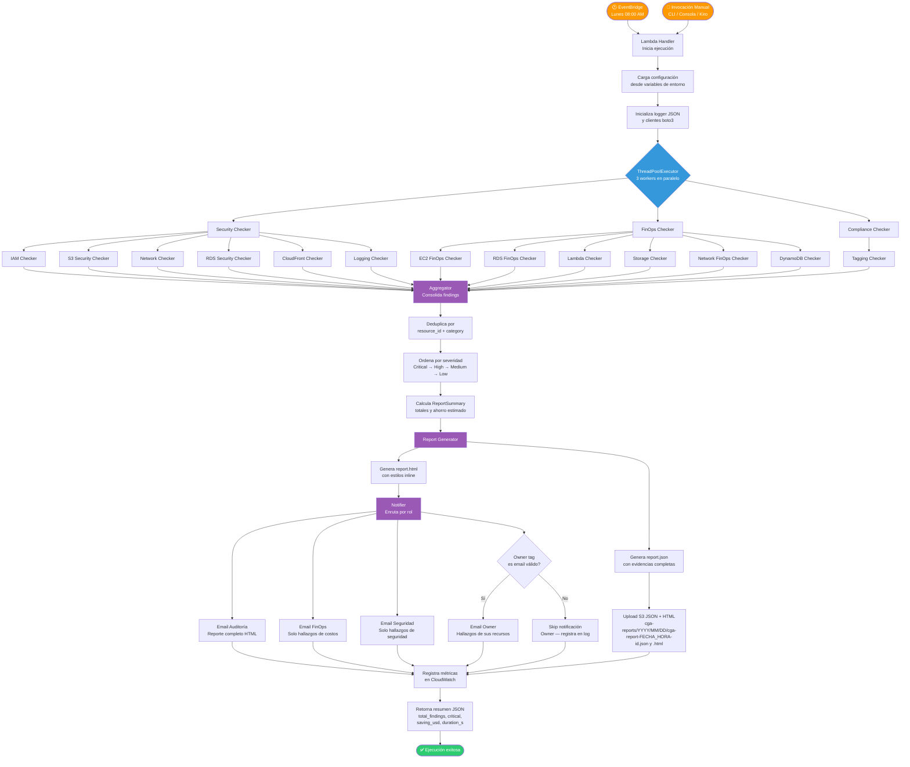
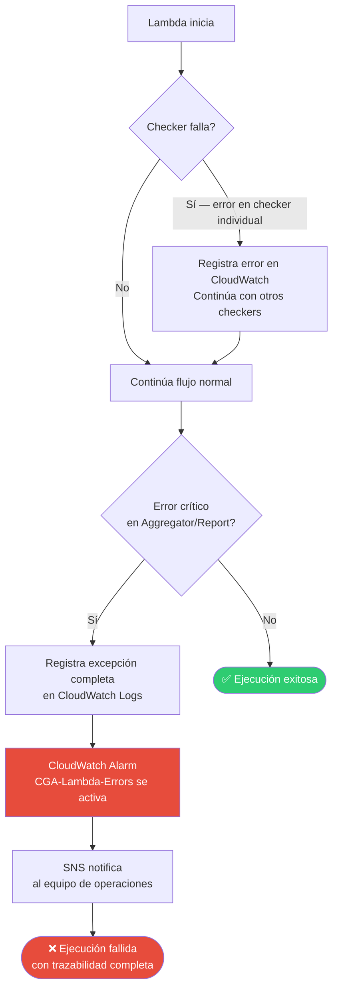
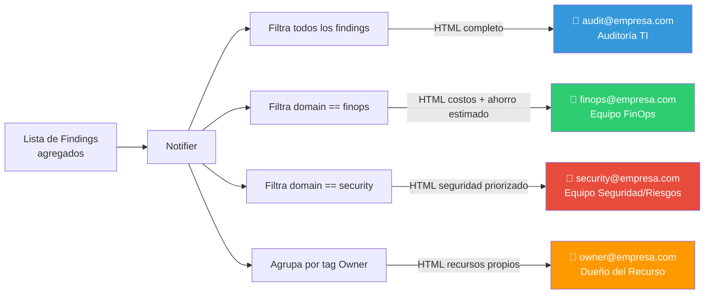

# Diagrama de Flujo de Ejecución — Cloud Governance Agent (CGA)

## Versión: 1.0.0 | Fecha: 2026-09-07

---

## Flujo Completo de Ejecución

---

## Flujo de Manejo de Errores

---

## Flujo de Enrutamiento de Notificaciones

---

## Notas de Implementación

- Los tres grupos de checkers (Security, FinOps, Compliance) se ejecutan en paralelo usando `ThreadPoolExecutor(max_workers=3)`
- Si un checker individual falla, el error se registra y la ejecución continúa con los demás — **no hay falla total por error parcial**
- El `report_id` es un UUID v4 generado al inicio de cada ejecución, usado para trazabilidad en S3 y CloudWatch
- La duración total se registra en CloudWatch como métrica `CGA/ExecutionDurationSeconds`
